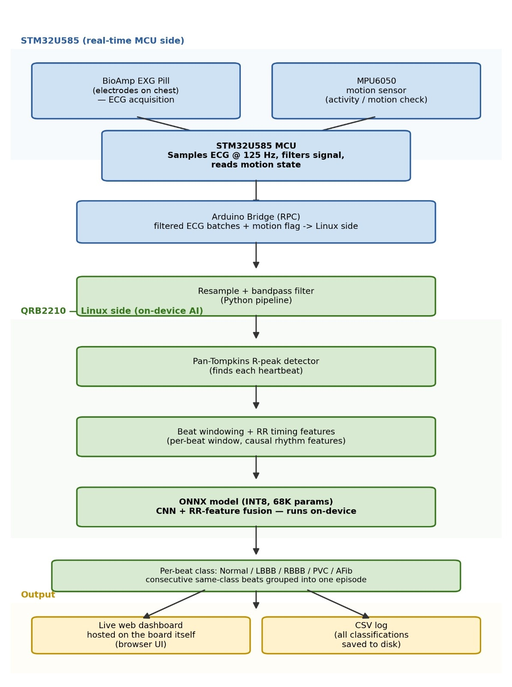
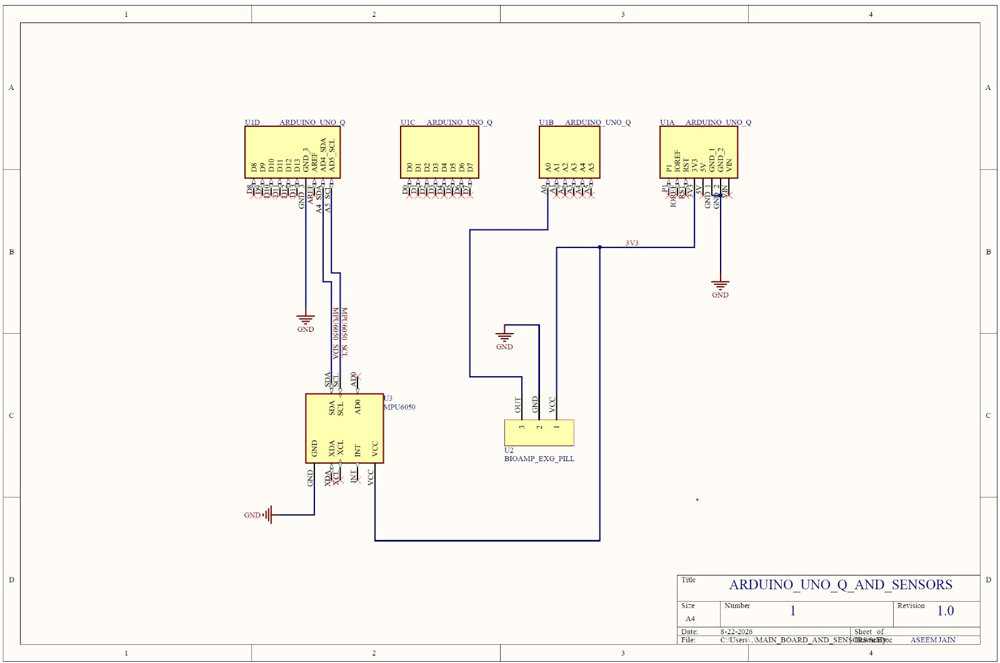
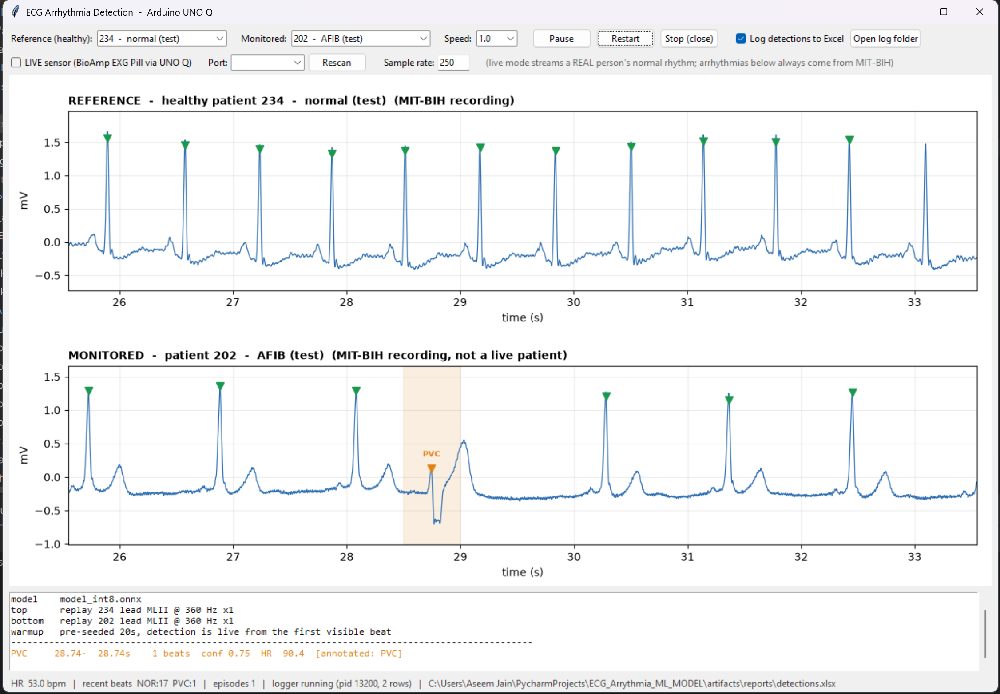
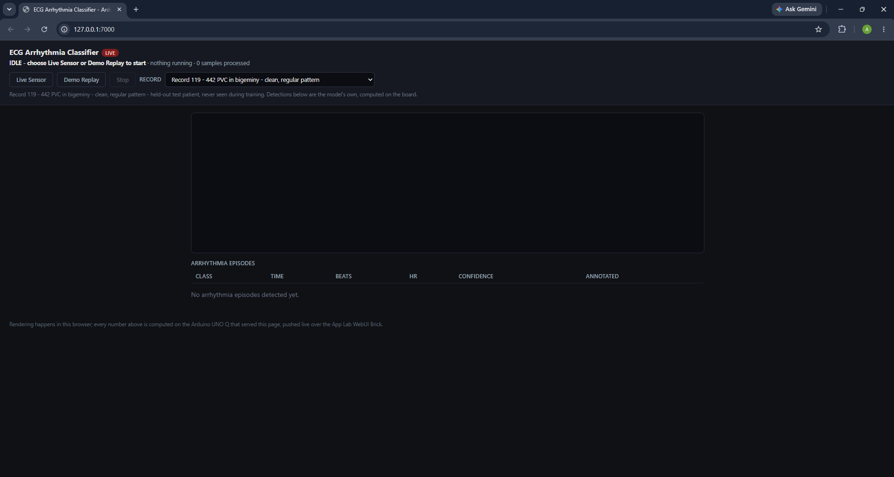
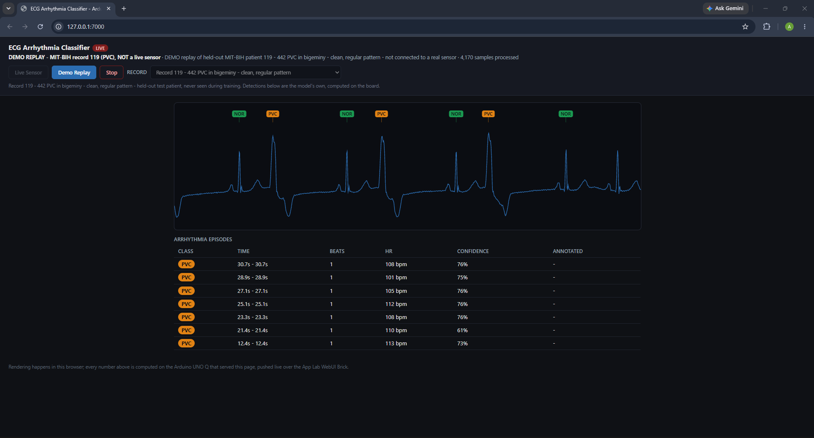
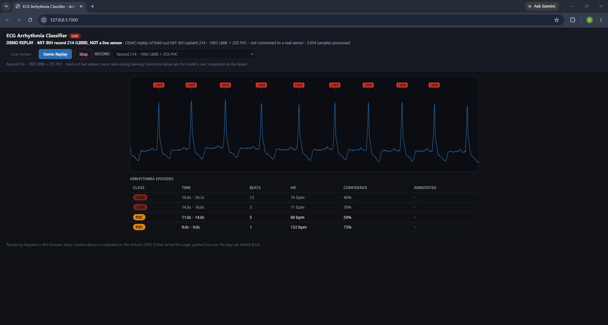
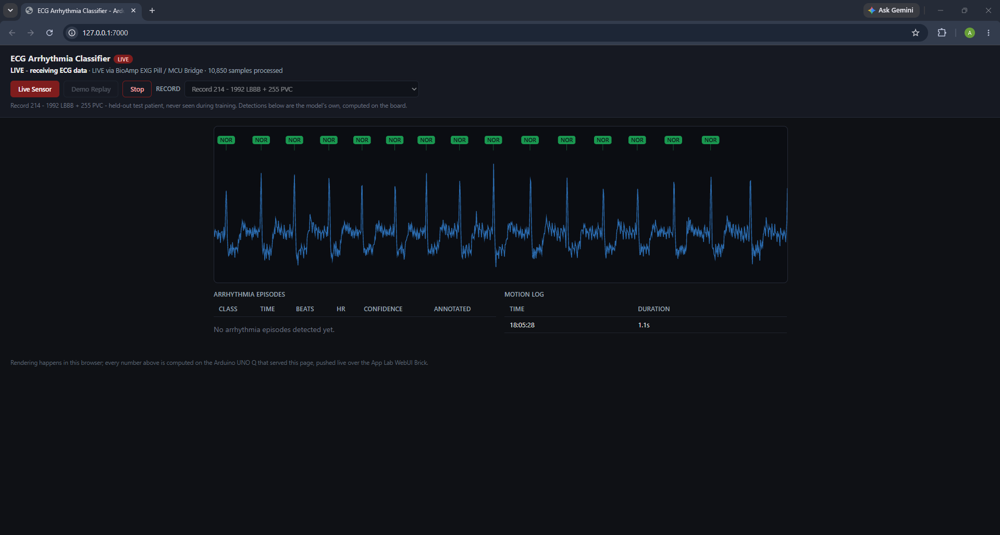
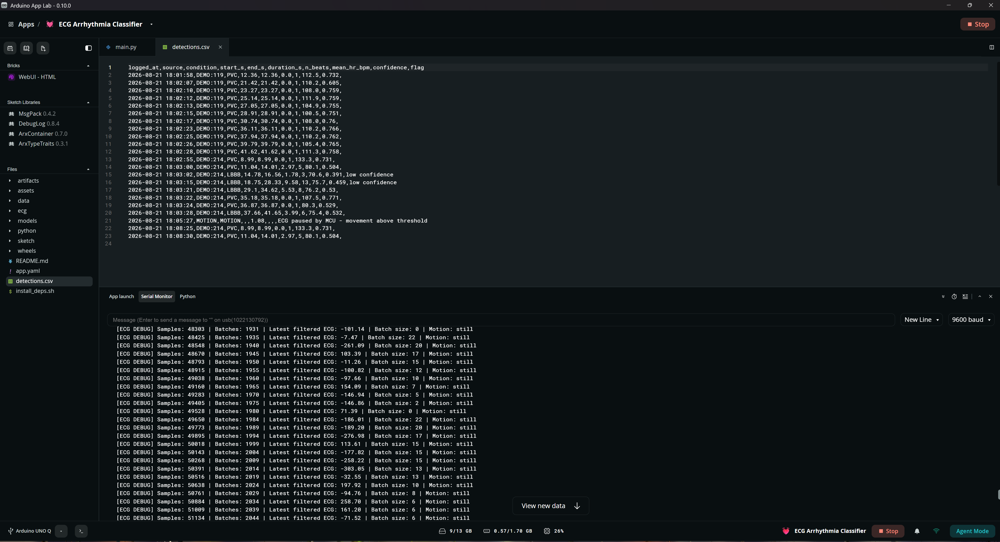
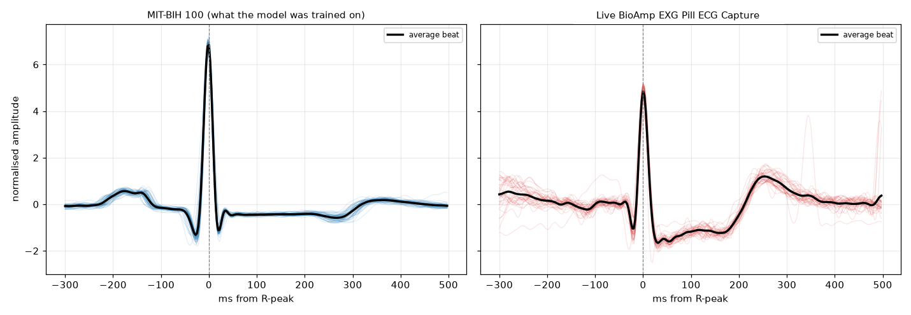

# ECG Arrhythmia Detection - MIT-BIH to ONNX INT8 on Arduino UNO Q

A per-beat 5-class arrhythmia classifier (NOR / LBBB / RBBB / PVC / AFIB) that
works off a single MLII-style lead. Trained on MIT-BIH and exported to a 91 KB
INT8 ONNX model with 67,909 parameters, which is small enough to run in real
time on the Arduino UNO Q's Cortex-A53. The idea is a home ECG monitor that
runs on hardware this size, without sending anything to a cloud service.

## Contents

- [Status](#status)
- [Repository layout](#repository-layout)
- [Architecture](#architecture)
- [Screenshots](#screenshots)
- [Results](#results-held-out-patients-int8-onnx)
- [How the data is split](#how-the-data-is-split)
- [Limitations](#limitations)
- [Pipeline](#pipeline)
- [Design decisions](#design-decisions)
- [Roadmap](#roadmap-towards-a-standalone-home-monitor)
- [Data](#data)
- [License](#license)

---

## Status

| part | status |
|---|---|
| ML pipeline (train / quantize / evaluate) | Done. macro F1 0.757, see [Results](#results-held-out-patients-int8-onnx) |
| Desktop demo GUI | Done. Dual waveform, limited to test-fold records by an automated check |
| On-device deployment (Arduino App Lab) | Done and run on the board. Live browser dashboard, plus a demo replay button that needs no hardware |
| Live BioAmp EXG Pill + MPU6050 | Done. Both sensors wired up and running through the dashboard's Live Sensor button, with real-time beat classification and motion gating |

### Docs

| doc | what is in it |
|---|---|
| This file | results, design decisions, limitations |
| [`DEPLOY_UNO_Q.md`](DEPLOY_UNO_Q.md) | how to get the model running on the board |
| [`applab/README.md`](applab/README.md) | how the App Lab app and its dashboard work |
| [`sensor-testing/`](sensor-testing/) | the two apps used to calibrate and verify the BioAmp EXG Pill + MPU6050 signal chain before it went into the classifier |

## Repository layout

```
ecg/                  shared library: data prep, model, Pan-Tompkins QRS detection,
                       and the inference pipeline that both the GUI and the board use
step1-4_*.py           training pipeline: build dataset -> train -> export/quantize -> evaluate
gui_app.py             desktop demo GUI (dual waveform, Excel logging)
applab/                the Arduino App Lab app: on-device source, MCU sketch, web
                       dashboard, build script
deploy/                headless deployment over SSH, without App Lab. A fallback.
data/mitdb/            MIT-BIH database (gitignored, rebuild with step1_build_dataset.py)
artifacts/             generated dataset/model/report output (gitignored)
docs/images/           figures used in this README
scripts/exploratory/   early data-exploration scripts behind some of the decisions below
sensor-testing/        two standalone apps used to calibrate and verify the BioAmp EXG
                       Pill + MPU6050 chain before live sensing went into the classifier
```

---

## Architecture





The MCU side samples the BioAmp EXG Pill at 125 Hz and reads the MPU6050
over I2C. Filtered ECG batches and motion state go over the Arduino Bridge
to the Linux side, where the pipeline above (resample, R-peak detect,
feature extraction, ONNX INT8) runs and pushes results to the dashboard
and a CSV log.

---

## Screenshots

Desktop demo GUI. Dual waveform, healthy reference patient on top and the
monitored patient below. This was before any hardware was involved:



The on-device dashboard, served from the UNO Q itself over the App Lab WebUI
Brick. Idle, replaying two different held-out MIT-BIH records, and running
against the live BioAmp EXG Pill:

 

 

Inside App Lab: the serial monitor showing filtered ECG samples arriving from
the MCU, and `detections.csv` on the board's own filesystem logging each
episode, including a real `MOTION` event:



---

## Results (held-out patients, INT8 ONNX)

The split is by patient, so no beat from a test patient appears anywhere in
training. Accuracy is listed only for completeness. With a 9.8x class
imbalance, a model that always answered "NOR" would score 65%.

| class | precision | recall | F1 | support |
|-------|-----------|--------|-----|---------|
| NOR   | 0.929 | 0.760 | 0.836 | 8,939 |
| LBBB  | 0.994 | 0.503 | 0.668 | 1,992 |
| RBBB  | 0.999 | 0.982 | 0.990 | 1,634 |
| PVC   | 0.464 | 0.991 | 0.632 | 1,622 |
| AFIB  | 0.596 | 0.739 | 0.660 | 3,285 |

macro F1 **0.757**, accuracy 0.769, 67,909 parameters, 91 KB INT8.

 

As a screening question instead (abnormal vs normal, which is what the GUI
highlights) it gives sensitivity 0.939 and specificity 0.760, so balanced
accuracy 0.850. That is an easier task than the 5-way one, so it sits next to
those numbers, not in place of them.

### Ablation: are the RR features worth having?

| variant | macro F1 | NOR | LBBB | RBBB | PVC | AFIB |
|---------|----------|-----|------|------|-----|------|
| CNN + RR fusion | **0.748** | 0.843 | 0.635 | 0.967 | 0.620 | 0.674 |
| CNN only        | 0.587 | 0.789 | 0.030 | 0.923 | 0.656 | 0.540 |

They are worth having: +0.160 macro F1. AFIB is the row to look at, since AFib
is a timing diagnosis and that is where the RR branch should help most. It
gains +0.134 there.

### Quantisation

| variant | macro F1 | agrees with PyTorch | size |
|---------|----------|---------------------|------|
| PyTorch FP32 | 0.7476 | - | 281 KB |
| ONNX FP32 | 0.7476 | 100.00% | 269 KB |
| ONNX INT8 | 0.7571 | 96.91% | **91 KB** |

INT8 costs no accuracy here (+0.010, which is inside run-to-run noise) and is
3x smaller. Single-beat latency is 0.066 ms on the dev PC against a budget of
about 300 ms. That number is from a desktop CPU, so measure it again on the
board before quoting it anywhere, since the Cortex-A53 is much slower.

---

## How the data is split

The 44 usable records are split by patient, not by beat:

| fold | records | beats | what the model got from it |
|------|---------|-------|----------------------------|
| train | 30 | 62,370 | weights fitted on these |
| val | 5 | 11,699 | not trained on, used only to pick which epoch to keep |
| test | 9 | 17,472 | not used at any point |

Every number in this README comes from the test fold.

Splitting by patient is stricter than just holding back some waveforms. If you
split by beat, the model can see beats 1 to 100 of a person during training and
then be tested on beat 101 of the same person. It would score well by
remembering that individual's heartbeat instead of learning what LBBB looks
like. Here a test patient is someone the model has never seen.

The GUI only offers held-out recordings, and `step1b_check_split.py` exits
non-zero if a training record ever ends up in the demo lists. Each entry in the
dropdown is marked `(test)` or `(val)` so a viewer can see how unseen it is.
9 of the 14 are fully held out.

## Limitations

These affect how the numbers above should be read.

- **LBBB rests on one test patient.** There are only 4 LBBB patients in all of
  MIT-BIH (109, 111, 207, 214), so one of them had to be the test patient. The
  LBBB recall of 0.503 is therefore a single-patient estimate with wide error
  bars. Folding the validation patients into training to get a third LBBB
  training patient made it worse (recall 0.275), so the limit is how few
  patients there are, not model capacity. The real fix is adding CPSC2018,
  which is on the roadmap below.
- **PVC precision is 0.464.** Almost all of it comes from record 233 (28% PVC
  burden) and from LBBB beats in 214 being called PVC. Both are wide-QRS
  classes and telling them apart is where this model is weakest.
- **AFIB vs NOR is the other main confusion.** AFib beats really do look
  normal on their own, only the rhythm gives them away, so this class leans
  hardest on the RR features being right.
- **No VF/VT detection.** Out of scope. It needs a window-based detector rather
  than beat segmentation, because VF has no organised QRS to segment in the
  first place.
- **No claim of live arrhythmia detection from a person.** The demo runs a live
  normal signal from a volunteer, and separately replays held-out MIT-BIH
  arrhythmia records. The GUI labels which is which.
- **Live accuracy has not been scored.** Live Sensor mode does classify the
  real signal from the BioAmp EXG Pill in real time, and the output is
  plausible, but there is no ground-truth-labelled live capture to score it
  against the way the MIT-BIH test fold was scored. So "the pipeline runs on
  live input" is the claim here, not a live accuracy figure.
- **The sample rate was wrong at first.** `MCU_SAMPLE_RATE` was set to 250 Hz,
  which matched two of the reference sketches but not the one actually in use.
  Timing a real BioAmp capture from its own timestamps gave 124.96 Hz (2950
  samples over 23.60 seconds), which matches the sketch's `FS_HZ` of 125. Every
  heart rate and RR interval was coming out exactly 2x too fast until that was
  corrected. The bundled selftest capture really is 250 Hz and is a separate
  constant (`SELFTEST_SAMPLE_RATE`); the demo replay path downsamples it to 125
  before feeding the live stream, so the two rates never mix.



Left is the average beat shape the model was trained on (MIT-BIH record 100).
Right is the average beat from a real BioAmp capture, aligned the same way.
Same QRS timing and roughly the same T-wave shape, so the sensor really is
producing an ECG the model can read.

---

## Pipeline

```
step1_build_dataset.py    MIT-BIH .dat/.atr  ->  artifacts/dataset/beats.npz
step1b_check_split.py     checks the patient-level split, fails loudly
step2_train.py            ->  artifacts/models/model_best.pt
step3_export_onnx.py      ->  model_fp32.onnx + model_int8.onnx
step4_evaluate.py         ->  artifacts/reports/evaluation.json + figures
```

```bash
python step1_build_dataset.py
python step1b_check_split.py
python step2_train.py
python step2_train.py --no-rr --tag model_cnn_only   # ablation
python step3_export_onnx.py
python step4_evaluate.py
```

Every stage writes its output to disk.

### Library

| module | role |
|--------|------|
| `ecg/config.py` | all the fixed decisions, in one place |
| `ecg/data.py` | labelling, windowing, rhythm features |
| `ecg/model.py` | the multi-input network |
| `ecg/qrs.py` | Pan-Tompkins R-peak detection |
| `ecg/pipeline.py` | the inference path, used by both the GUI and the board |
| `ecg/metrics.py` | per-class reporting, confusion plots |

---

## Design decisions

**Per-beat, not per-recording.** R-peak-centred windows with one label per
beat, from 0.30 s before to 0.50 s after, which is 288 samples at 360 Hz. A
whole-recording approach would mean waiting 60 seconds for an answer, and a
monitor needs to respond within a beat or two.

**Lead MLII, picked by name.** The BioAmp EXG Pill gives a limb-lead-like
signal, so training on a V1 chest lead would score better in testing but not
match the sensor we deploy with. The channel comes from `sig_name`, never from
an index. Record 114 has its MLII in channel 1 and sits in the test set on
purpose, so going back to index-based selection would break the test score
instead of quietly degrading it.

**Polarity normalisation.** Each beat is flipped so the dominant QRS deflection
points up. MIT-BIH has the same condition recorded in both polarities (LBBB in
207 is inverted compared to 109 and 111). Held-out LBBB correlated -0.24 with
the training LBBB mean before this step and +0.80 after, and LBBB F1 went from
0.017 to 0.766. It is just as valid on the device, since swapping two
electrodes inverts the trace the same way.


The same three conditions (normal, LBBB, RBBB) and the same patients, seen
through two different leads. The limb lead on the left is what the BioAmp
gives; the chest lead on the right is what a lot of reference pictures use.
They do not agree on shape, which is why the lead is picked by name and why
polarity normalisation is needed.

**Causal rhythm features only.** All 10 numeric features look backwards only,
computed from a 10-entry RR ring buffer, so the same code runs in real time on
the UNO Q with no lookahead. Three describe this beat's timing, five describe
how irregular the last 10 beats were, and two are ectopy-robust copies that
median-replace outlier intervals. That last pair exists because a PVC's
short-then-long pair looks just like AFib to a plain RMSSD. Without them, 93%
of record 233's normal beats were being called AFib.

 

AFib beats can look completely normal on their own, it is the RR timing that
gives it away. On the left, RR interval beat to beat, regular vs jagged. On the
right, the same thing as a Poincare plot, a tight cluster vs a wide smear. This
is why the model needs the RR branch and not only the waveform CNN. The
ablation table above shows the same thing in numbers.

**No LSTM, at least for now.** There isn't much long-range structure in a
single beat for a recurrent layer to use, and recurrence parallelises badly on
a Cortex-A53. See the roadmap for when this is worth revisiting.

**Weight EMA for picking the checkpoint.** Held-out macro F1 swung between 0.47
and 0.73 between adjacent epochs. With only 5 validation patients the selection
signal is noisy, and "best epoch" was a lottery that gave LBBB F1 of either
0.77 or 0.56 depending on luck. Averaging the weights over about 4 epochs makes
the choice repeatable.

**AFib labelling.** A beat inside an `(AFIB` rhythm annotation is labelled AFIB
whatever its own symbol says, since most AFib beats carry symbol 'N'. Setting
`AFIB_OVERRIDES_ALL_SYMBOLS` to False in config flips this if you want to
compare.

**Excluded records:** 102, 104, 107 and 217, all paced. Pacing changes QRS
shape completely and "paced" is not one of the five classes. 102 and 104 have
no MLII channel at all, so they would have been dropped anyway.

---

## Roadmap: towards a standalone home monitor

Everything above is built. Below is what comes next.

- **On-device display.** A small TFT or OLED wired to the board showing the
  live waveform and the detected class, so no browser, phone or network is
  needed to see a result.
- **Fully offline.** No internet at any point. The App Lab dashboard is a
  development and demo convenience, not the end state.
- **CPSC2018 supplementation.** This is the real fix for the LBBB
  single-patient problem listed above, and the next accuracy lever worth
  pulling.
- **More electrodes, closer to 12-lead.** The model uses one MLII-equivalent
  lead today. Adding BioAmp channels towards a standard 12-lead placement would
  give both the model and a viewer more to work with.
- **Revisit attention and BiLSTM, inside a budget.** There is no recurrence in
  this model because it was not worth it at this scale. With more data and more
  leads that trade-off is worth testing again, but only if the total stays
  under 0.5M parameters so it still fits on the same class of hardware.

---

## Data

Trained on the MIT-BIH Arrhythmia Database:

> Moody GB, Mark RG. The impact of the MIT-BIH Arrhythmia Database.
> *IEEE Eng in Med and Biol* 20(3):45-50 (May-June 2001).
>
> Goldberger AL, Amaral LAN, Glass L, Hausdorff JM, Ivanov PCh, Mark RG,
> Mietus JE, Moody GB, Peng CK, Stanley HE. PhysioBank, PhysioToolkit, and
> PhysioNet: Components of a New Research Resource for Complex Physiologic
> Signals. *Circulation* 101(23):e215-e220 (2000).

Distributed under the [Open Data Commons Attribution License v1.0](https://physionet.org/content/mitdb/1.0.0/) via [PhysioNet](https://physionet.org/content/mitdb/1.0.0/).
Not redistributed here (see `.gitignore`), run `step1_build_dataset.py` to
download it.

## License

Code in this repository is [MIT licensed](LICENSE). The MIT-BIH dataset has its
own license, listed above, and is not covered by that grant.
