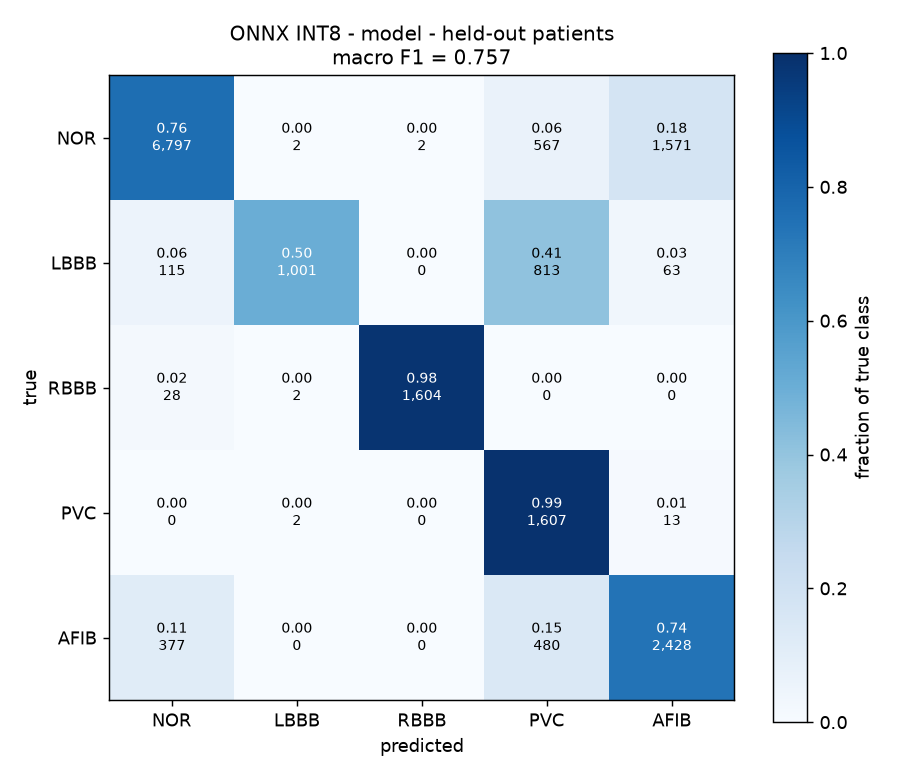
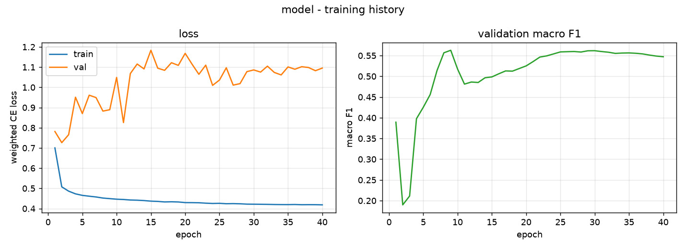
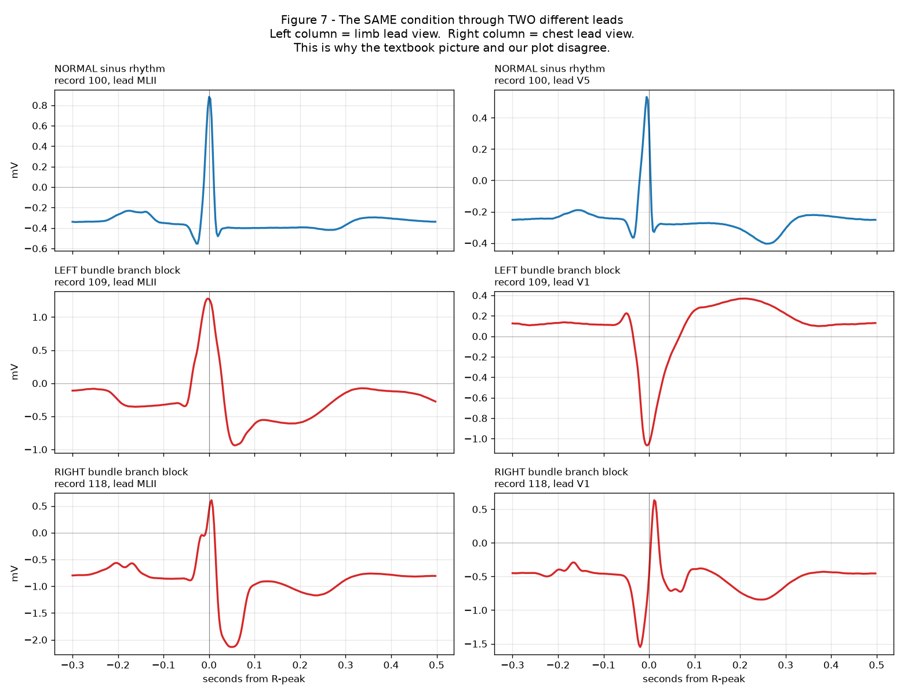
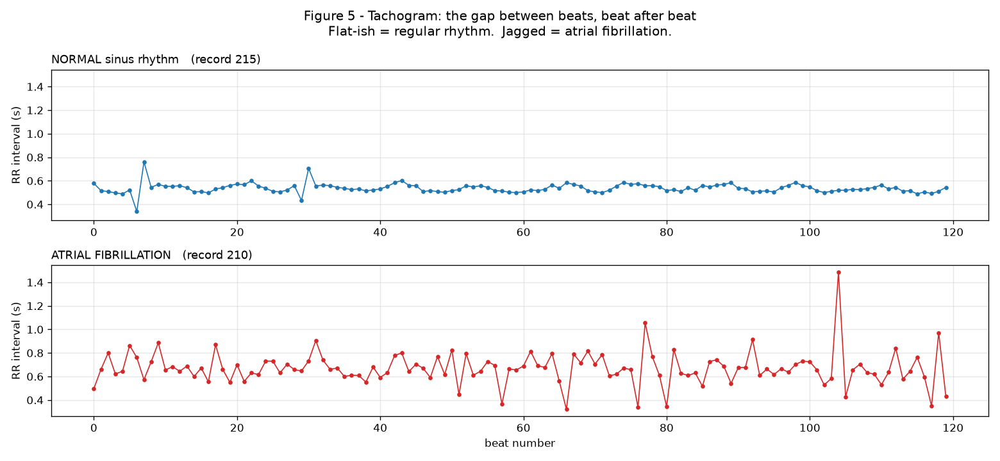
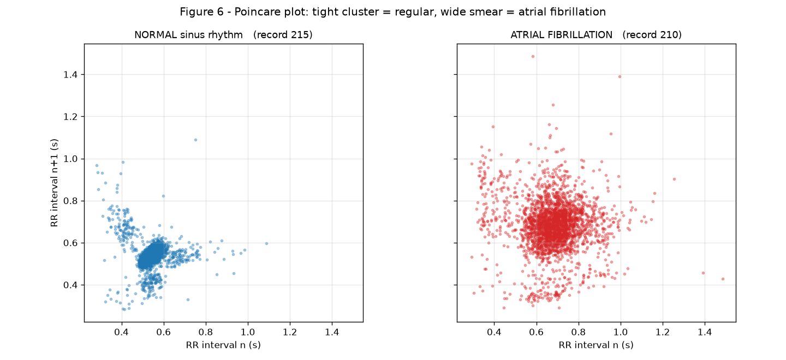

# ECG Arrhythmia Detection — MIT-BIH → ONNX INT8 → Arduino UNO Q

Per-beat 5-class arrhythmia classification (NOR / LBBB / RBBB / PVC / AFIB)
from a single MLII-equivalent lead, trained on MIT-BIH and exported to a
91 KB INT8 ONNX model for the QRB2210 Linux side of an Arduino UNO Q.

Built for the **Arduino Physical AI Challenge India 2026**.

---

## Status

| | |
|---|---|
| ML pipeline (train / quantize / evaluate) | Done — macro F1 0.757, see [Results](#results-held-out-patients-int8-onnx) below |
| Desktop demo GUI | ✅ Done — dual waveform, test-fold-only enforced by an automated guard |
| On-device deployment (Arduino App Lab) | Done and verified — live browser dashboard, no-hardware demo replay button |
| Live BioAmp EXG Pill sensor integration | In progress — hardware chain validated end-to-end (real ADC noise through the real Bridge pipeline); electrode test with a real signal is the current step |

**Known limitation, not yet fixed:** the classifier assumes the MCU samples
ECG at **250 Hz**, matching two of the reference sketches used during
development. The sketch actually in use now samples at **125 Hz** (its
`FS_HZ` constant says so, even though comments elsewhere in that file still
say 250). This hasn't been fixed in the classifier yet — see
[Honest limitations](#honest-limitations) below. Getting it wrong wouldn't
crash anything, it would just silently scale every heart rate and RR
interval, so treat any on-device timing numbers as unverified for now.

### Docs

| doc | for |
|---|---|
| **This file** | results, design decisions, limitations |
| [`DEPLOY_UNO_Q.md`](DEPLOY_UNO_Q.md) | step-by-step guide to running the model on the board |
| [`applab/README.md`](applab/README.md) | how the on-device App Lab app and its live dashboard work |

## Repository layout

```
ecg/                  shared library — data prep, model, Pan-Tompkins QRS detection,
                       the one inference pipeline used by both the desktop GUI and on-device app
step1-4_*.py           training pipeline: build dataset -> train -> export/quantize -> evaluate
gui_app.py             desktop demo GUI (dual waveform, Excel logging)
applab/                the Arduino App Lab app: on-device source, live web dashboard, build script
deploy/                generic headless deployment path (SSH/terminal, no App Lab) — a fallback
data/mitdb/            MIT-BIH database (gitignored — regenerate with step1_build_dataset.py)
artifacts/             generated dataset/model/report outputs (gitignored — regenerable)
docs/images/           result figures referenced from this README
scripts/exploratory/   early data-exploration scripts behind some of the design decisions below
```

---

## Results (held-out patients, INT8 ONNX)

The split is **patient-level**: no beat from a test patient appears anywhere
in training. Overall accuracy is reported only for completeness — with a
9.8× class imbalance a model that always answered "NOR" would score 65%.

| class | precision | recall | F1 | support |
|-------|-----------|--------|-----|---------|
| NOR   | 0.929 | 0.760 | 0.836 | 8,939 |
| LBBB  | 0.994 | 0.503 | 0.668 | 1,992 |
| RBBB  | 0.999 | 0.982 | 0.990 | 1,634 |
| PVC   | 0.464 | 0.991 | 0.632 | 1,622 |
| AFIB  | 0.596 | 0.739 | 0.660 | 3,285 |

**macro F1 0.757** · accuracy 0.769 · 67,909 parameters · 91 KB INT8

 

As a screening question (abnormal vs normal, which is what the GUI
highlights): **sensitivity 0.939, specificity 0.760**, balanced accuracy
0.850. This is a strictly easier task than the 5-way one above and is
reported alongside it, not instead of it.

### Ablation — do the RR features earn their place?

| variant | macro F1 | NOR | LBBB | RBBB | PVC | AFIB |
|---------|----------|-----|------|------|-----|------|
| CNN + RR fusion | **0.748** | 0.843 | 0.635 | 0.967 | 0.620 | 0.674 |
| CNN only        | 0.587 | 0.789 | 0.030 | 0.923 | 0.656 | 0.540 |

+0.160 macro F1. AFIB is the row that matters — it is a timing diagnosis, so
the fusion has to earn its place there, and it does (+0.134).

### Quantisation

| variant | macro F1 | agrees with PyTorch | size |
|---------|----------|---------------------|------|
| PyTorch FP32 | 0.7476 | — | 281 KB |
| ONNX FP32 | 0.7476 | 100.00% | 269 KB |
| ONNX INT8 | 0.7571 | 96.91% | **91 KB** |

INT8 costs no accuracy (+0.010, within run-to-run noise) at 3× smaller.
Single-beat latency 0.066 ms on the dev PC's CPU against a ~300 ms budget.
**Measure on the actual board before quoting a latency number** — the
Cortex-A53 is much slower than this CPU.

---

## What the demo actually proves

The 44 usable records are split by **patient**, not by beat:

| fold | records | beats | what the model got from it |
|------|---------|-------|----------------------------|
| train | 30 | 62,370 | weights fitted on these |
| val | 5 | 11,699 | never learned from; used only to choose which epoch's checkpoint to keep |
| test | 9 | 17,472 | **never touched in any way** |

Every number in this README comes from the **test** fold alone.

A patient-level split is stricter than simply holding back some waveforms.
Splitting by beat would let the model see beats 1-100 of a person in training
and be tested on beat 101 of the same person — it would score well by
memorising that individual's heartbeat rather than by learning what LBBB is.
Here, a test patient's heart is one the model has never seen at all.

The GUI only offers held-out recordings, and `step1b_check_split.py` fails
with a non-zero exit code if a training record is ever added to the demo
lists. Each entry is labelled `(test)` or `(val)` in the dropdown so a viewer
can see exactly how unseen it is; 9 of the 14 are fully held out.

## Honest limitations

These are stated because they affect how the numbers should be read.

- **LBBB rests on one test patient.** LBBB exists in only 4 patients in all
  of MIT-BIH (109, 111, 207, 214). One had to be the test patient, so LBBB
  recall (0.503) is a single-patient estimate with wide error bars. Folding
  the validation patients into training to get a third LBBB training patient
  was tried and made it *worse* (recall 0.275) — the limit is patient
  diversity, not model capacity. The real fix is CPSC2018 supplementation,
  which the project brief defers until the MIT-BIH loop works end to end.
- **PVC precision is 0.464**, driven almost entirely by record 233 (28% PVC
  burden) and by LBBB beats from 214 being called PVC. Both are wide-QRS
  classes; separating them is the model's weakest axis.
- **AFIB vs NOR** is the other main confusion. AFib beats genuinely look
  normal — only the rhythm distinguishes them — so this is the class most
  dependent on the RR window features being right.
- **No VF/VT detection.** Out of scope: it needs a window-based detector,
  not beat segmentation, because VF has no organised QRS to segment.
- **No claim of live arrhythmia detection from a person.** The demo runs a
  live *normal* signal from a volunteer and separately replays held-out
  MIT-BIH arrhythmia records. The GUI labels which is which.
- **On-device sample rate doesn't match the real sensor sketch yet.**
  `MCU_SAMPLE_RATE` in `applab/python/main.py` and the `--fs 250` examples
  in `DEPLOY_UNO_Q.md` assume 250 Hz, which was true for two of the
  reference sketches used during development. The sketch actually in use
  samples at **125 Hz** (its `FS_HZ` constant, not the comments around it,
  which are stale). Not fixed yet — a wrong rate wouldn't crash anything,
  it would just silently scale every heart rate and RR interval, so
  on-device timing numbers should be treated as unverified for now.
- **Live sensor integration is in progress, not finished.** The Bridge
  pipeline (MCU → Linux side) has been checked end-to-end with real ADC
  samples, but classifying an actual electrode signal from the BioAmp EXG
  Pill hasn't been confirmed working yet. See [Status](#status) above.

---

## Pipeline

```
step1_build_dataset.py    MIT-BIH .dat/.atr  ->  artifacts/dataset/beats.npz
step1b_check_split.py     validates the patient-level split, fails loudly
step2_train.py            ->  artifacts/models/model_best.pt
step3_export_onnx.py      ->  model_fp32.onnx + model_int8.onnx (verified)
step4_evaluate.py         ->  artifacts/reports/evaluation.json + figures
```

```bash
python step1_build_dataset.py
python step1b_check_split.py
python step2_train.py
python step2_train.py --no-rr --tag model_cnn_only   # ablation
python step3_export_onnx.py
python step4_evaluate.py
```

Every stage writes to disk. Nothing exists only in RAM.

### Library

| module | role |
|--------|------|
| `ecg/config.py` | every locked decision, in one place |
| `ecg/data.py` | labelling, windowing, rhythm features |
| `ecg/model.py` | the multi-input network |
| `ecg/qrs.py` | Pan-Tompkins R-peak detection |
| `ecg/pipeline.py` | **the one inference path** — GUI and live both call this |
| `ecg/metrics.py` | per-class reporting, confusion plots |

---

## Key design decisions

**Per-beat, not per-recording.** R-peak-centred windows, one label per beat,
0.30 s before to 0.50 s after at 360 Hz = 288 samples. Chosen over the
whole-recording approach of the reference paper because the product has to
respond within a beat or two, not after 60 seconds.

**Lead MLII, selected by name.** The BioAmp EXG Pill produces a limb-lead-like
signal, so training on a V1 chest lead would score better in testing and
mismatch the deployment sensor. Channel is chosen from `sig_name`, never by
index — record 114 has MLII in channel 1, and it is deliberately placed in
the test set so that a regression to index-based selection would break the
score visibly instead of rotting quietly.

**Polarity normalisation.** Each beat is flipped so its dominant QRS
deflection points up. MIT-BIH contains the same condition in both polarities
(LBBB in 207 is inverted relative to 109/111); held-out LBBB correlated
**−0.24** with the training LBBB mean before this step and **+0.80** after,
and LBBB F1 went 0.017 → 0.766. It is equally valid on the device: swapping
two electrodes inverts the trace identically.



*Same three conditions (normal, LBBB, RBBB), same patients, viewed through
two different leads. The limb lead (left, what the BioAmp produces) and
chest lead (right, what a lot of reference pictures use) don't agree on
shape — this is why picking the lead by name instead of by channel index
matters, and part of why polarity normalisation is needed at all.*

**Causal rhythm features only.** All 10 numeric features look strictly
backwards, computed from a 10-entry RR ring buffer, so the identical code
runs in real time on the UNO Q with no lookahead. Three describe this beat's
timing; five describe the irregularity of the last 10 beats; two are
ectopy-robust copies that median-replace outlier intervals. That last pair
exists because a PVC's short-then-compensatory-long pair looks exactly like
AFib to a plain RMSSD — without it, 93% of record 233's normal beats were
called AFib.

 

*AFib beats can look completely normal on their own — it's the RR timing
that gives it away. Left: RR interval beat-to-beat, regular vs jagged.
Right: same idea as a Poincare plot, a tight cluster vs a wide smear. This
is the entire reason the model needs the RR-feature branch, not just the
waveform CNN — see the ablation numbers above.*

**No LSTM.** On a single segmented beat there is minimal long-range temporal
structure to exploit, and recurrence parallelises badly on a Cortex-A53. The
reference paper's own ablation showed diminishing returns from its BiLSTM.

**Weight EMA for checkpoint selection.** Held-out macro F1 swung between 0.47
and 0.73 between adjacent epochs — with only 5 validation patients the
selection signal is genuinely noisy, and "best epoch" was a lottery that
produced LBBB F1 of 0.77 or 0.56 depending on luck. Averaging the weights
over ~4 epochs makes the choice reproducible.

**AFib labelling.** A beat inside an `(AFIB` rhythm annotation is AFIB
regardless of its own symbol, since most AFib beats carry symbol 'N'.
`AFIB_OVERRIDES_ALL_SYMBOLS` in config flips this if you want to compare.

**Excluded records:** 102, 104, 107, 217 (paced beats — pacing changes QRS
shape completely and "paced" is not one of our classes). 102 and 104 have no
MLII channel at all, so they would have been excluded regardless.

---

## Prior art

"Tiny Arrhythmia Classification" — arxiv.org/html/2511.08650 — cited as
architectural inspiration only; no code copied (their repo has no licence).
Their setup differs on nearly every axis (whole-60 s windows, 9 CPSC classes,
250 Hz, CNN+attention+BiLSTM at 0.945M params, benchmarked on a Pi 4/4GB), so
their numbers are **not** comparable to these and are not presented as such.

---

## Data

Trained on the **MIT-BIH Arrhythmia Database**:

> Moody GB, Mark RG. The impact of the MIT-BIH Arrhythmia Database.
> *IEEE Eng in Med and Biol* 20(3):45-50 (May-June 2001).
>
> Goldberger AL, Amaral LAN, Glass L, Hausdorff JM, Ivanov PCh, Mark RG,
> Mietus JE, Moody GB, Peng CK, Stanley HE. PhysioBank, PhysioToolkit, and
> PhysioNet: Components of a New Research Resource for Complex Physiologic
> Signals. *Circulation* 101(23):e215-e220 (2000).

Distributed under the [Open Data Commons Attribution License v1.0](https://physionet.org/content/mitdb/1.0.0/) via [PhysioNet](https://physionet.org/content/mitdb/1.0.0/).
Not redistributed in this repo (see `.gitignore`) — run `step1_build_dataset.py` to download it.

## License

Code in this repository is [MIT licensed](LICENSE). The MIT-BIH dataset
itself carries its own license (above) and is not part of this grant.
