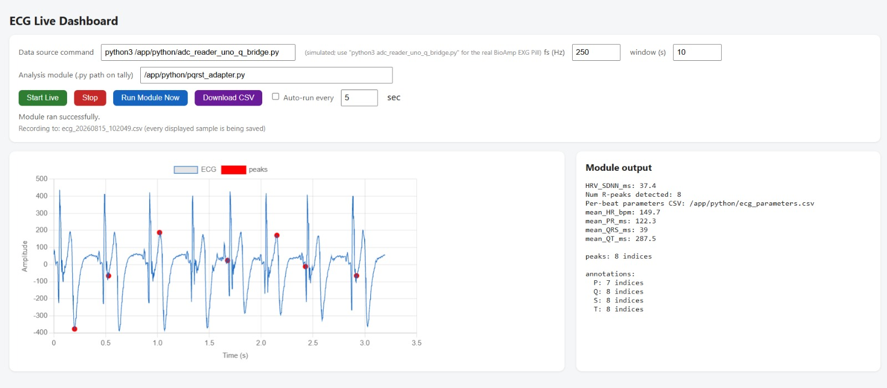
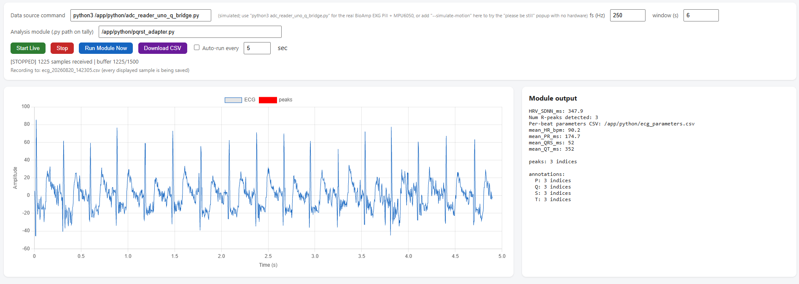

# ECG Monitor — Uno Q + BioAmp EXG Pill

Live ECG acquisition, streaming, and P‑QRS‑T analysis for the Arduino Uno Q
("tally"), built as a standard Arduino App Lab / `arduino-app-cli` app
(dual-brain: MCU sketch + Linux/Python).

Part of the sensor calibration and output verification work behind the
[ECG arrhythmia classifier](../../README.md) this repo is built around —
this app is where the BioAmp EXG Pill + MPU6050 signal chain was tested and
tuned before the classifier's own live sensor path was built.

## Contents

- [Project structure](#project-structure)
- [How the pieces connect](#how-the-pieces-connect)
- [Quick start](#quick-start)
- [Try it with no hardware at all](#try-it-with-no-hardware-at-all)
- [Writing your own analysis module](#writing-your-own-analysis-module)
- [Real hardware wiring](#real-hardware-wiring)
- [Motion detection / "please be still" popup](#motion-detection--please-be-still-popup)
- [Screenshots](#screenshots)

## Project structure

```
ecg_monitor_app/
├── README.md
├── app.yaml                     # App Lab manifest (Linux side)
├── sample_ecg.csv               # sample recording, for testing without hardware
├── python/                      # MPU / Linux side
│   ├── main.py                  # <-- START HERE. Single entry point, see below.
│   ├── requirements.txt
│   ├── live_stream.py           # LiveReader: subprocess + rolling buffer
│   ├── adc_reader_template.py   # simulated data source (no hardware needed)
│   ├── adc_reader_uno_q_bridge.py # real data source (BioAmp Pill via Bridge)
│   ├── ecg_web_dashboard.py     # browser dashboard (default UI, headless-friendly)
│   ├── ecg_gui_live.py          # Tkinter live desktop GUI (needs a display)
│   ├── ecg_gui.py               # Tkinter offline file-viewer GUI
│   ├── ecg_pqrst_detector.py    # Pan-Tompkins + P/Q/S/T detection pipeline (CLI)
│   ├── pqrst_adapter.py         # wraps the detector as analyze(signal, fs)
│   └── user_module.py           # simpler example analyze(signal, fs)
└── sketch/                      # MCU (STM32U585) side
    ├── sketch.ino     # samples A0 @ 250 Hz, streams batches over Bridge
    └── sketch.yaml              # board FQBN + Bridge library dependencies
```

## How the pieces connect

```
BioAmp EXG Pill --A0--> [MCU: sketch.ino] <--I2C-- MPU6050 (motion)
                              |
                              | Bridge.notify("ecg_batch", 25 samples @ 250Hz)
                              | -- paused automatically while the MPU6050
                              |    reports a big displacement --
                              |
                              | Bridge.notify("motion_state", 1|0)
                              | -- edge-triggered, on every motion state change --
                              v
                        [MPU: adc_reader_uno_q_bridge.py]
                              | prints one ECG sample per line, and
                              | "MOTION:0"/"MOTION:1" sentinel lines,
                              | on the same stdout stream
                              v
                        [MPU: live_stream.py -> LiveReader]
                              | rolling buffer + motion flag,
                              | thread-safe snapshot() / status()
                              v
              +---------------+----------------+
              |                                |
     [ecg_web_dashboard.py]           [ecg_gui_live.py]
     browser UI, any device            Tkinter desktop UI,
     on the network, no                needs a monitor on
     monitor needed on tally.          tally
     Shows a "please be still"
     popup while motion_detected
     is true.
              |                                |
              +---------------+----------------+
                              v
                [pqrst_adapter.py -> ecg_pqrst_detector.py]
                Pan-Tompkins R-peaks, P/Q/S/T detection,
                HR / PR / QRS / QT extraction
```

`adc_reader_template.py` is a drop-in stand-in for
`adc_reader_uno_q_bridge.py` with the identical one-sample-per-line stdout
contract, so every mode below also works with `--source simulate` and no
hardware attached at all.

## Quick start

**On the Uno Q, via App Lab / arduino-app-cli** (recommended — builds and
flashes the sketch too):

```bash
arduino-app-cli app start ~/ArduinoApps/ecg_monitor_app
arduino-app-cli app logs  ~/ArduinoApps/ecg_monitor_app
```

This runs `python/main.py` with no arguments, which starts the web
dashboard in simulate mode on port 5000. Open `http://<tally-ip>:5000`
from any browser on the network. Switch the "Data source command" field
in the page to `python3 adc_reader_uno_q_bridge.py` (or pass
`--source real` below) once the sketch is flashed and the Pill is wired
to A0.

**Directly (any of the four modes)**, from inside `python/`:

```bash
# Browser dashboard, simulated signal (default, no hardware required)
python3 main.py

# Browser dashboard, real BioAmp Pill data (sketch must be running on the MCU)
python3 main.py --mode web --source real

# Tkinter live desktop GUI (needs a monitor on tally, or X11 forwarding)
python3 main.py --mode live --source real

# Offline viewer: load and analyze an already-recorded CSV
python3 main.py --mode gui ../sample_ecg.csv --fs 250

# Headless one-shot analysis of a CSV, no GUI/server at all
python3 main.py --mode cli ../sample_ecg.csv --fs 250 --plot
```

Run `python3 main.py --help` for the full flag list (`--fs`, `--window`,
`--port`, `--powerline`, `--plot`).

## Try it with no hardware at all

`sample_ecg.csv` is a real recorded ECG trace included for testing the
analysis pipeline immediately:

```bash
cd python
python3 main.py --mode cli ../sample_ecg.csv --fs 250 --plot
```

This writes `ecg_parameters.csv` (per-beat RR/PR/QRS/QT intervals) and, with
`--plot`, a `pqrst_plot.png` showing the detected P/Q/R/S/T points on the
first few beats.

## Writing your own analysis module

Any `.py` file with an `analyze(signal: np.ndarray, fs: float) -> dict`
function can be pointed at from any of the GUI/web modes (see
`user_module.py` for a minimal template, and `pqrst_adapter.py` for the
full clinical-parameter version). Returned `"peaks"` and `"annotations"`
keys are drawn as overlays on the live/offline plots automatically.

## Real hardware wiring

BioAmp EXG Pill output → Uno Q **A0**. Flash `sketch/sketch.ino`
to the MCU (App Lab / `arduino-app-cli` does this automatically as part of
`app start`; `sketch/sketch.yaml` pins the board FQBN and Bridge library
versions for a reproducible build). The sketch batches 25 raw ADC samples
(100 ms) per `Bridge.notify("ecg_batch", ...)` call;
`adc_reader_uno_q_bridge.py` unpacks each batch back into one sample per
line so it's indistinguishable, downstream, from the simulator.

**MPU6050 (motion sensor, for the "please be still" feature)**: VCC →
3V3/5V, GND → GND, SDA → board SDA, SCL → board SCL (A4/A5 also work on
many I2C-capable boards — see `sketch/sketch.ino` for details). No extra
Arduino library is needed; it's read directly over `Wire` at the register
level.

## Motion detection / "please be still" popup

`sketch/sketch.ino` samples the MPU6050 at 50 Hz and tracks how far the
accelerometer's magnitude drifts from its resting ("at rest") baseline.
When that drift stays above a threshold for a few consecutive samples, a
big displacement is declared:

- The MCU **pauses ECG collection** — no more `ecg_batch` notifications go
  out until the sensor is still again (a moving electrode produces motion
  artifact, not real cardiac signal, so it's dropped rather than shipped).
- The MCU sends one edge-triggered `Bridge.notify("motion_state", 1|0)`
  per state change.
- `adc_reader_uno_q_bridge.py` relays that as a `MOTION:0`/`MOTION:1` line
  on the same stdout stream used for ECG samples.
- `live_stream.py`'s `LiveReader` recognizes that prefix, keeps it out of
  the sample buffer/CSV log, and exposes it as
  `status()["motion_detected"]`.
- `ecg_web_dashboard.py` shows a red **"Please stay still"** overlay on
  the live chart whenever `motion_detected` is true, and clears it once
  motion stops.

Tune sensitivity in `sketch/sketch.ino` via `MOTION_THRESHOLD_G` (how big a
displacement counts) and `MOTION_DEBOUNCE_COUNT` (how many consecutive
readings before the state flips).

**Try the popup with no hardware attached**: in the web dashboard, set
"Data source command" to:

```
python3 adc_reader_template.py --fs 250 --simulate-motion
```

This periodically emits fake `MOTION:0`/`MOTION:1` lines (still for 12 s,
"moving" for 4 s, repeating) so you can see the overlay appear and clear
before wiring up a real MPU6050.

## Screenshots

The dashboard's data source set to the real Bridge (`adc_reader_uno_q_bridge.py`),
capturing from the BioAmp EXG Pill:




